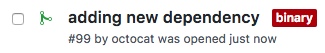
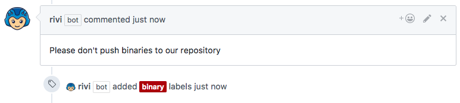

# Warn if committing binaries

## Example `rivi.yaml`

```yaml
rules:
    binary:
        condition:
          files:
            extensions:
              - ".jar"
              - ".zip"
              - ".tar"
              - ".gz"
              - ".bz2"
              - ".z"
              - ".tgz"
              - ".deb"
              - ".rpm"
        labeler:
          label: binary
        commenter:
          comment: "Please don't push binaries to our repository"
```

**Note** The label `binary` must exists in the repository settings  

## Result

When a pull-request containing binary/archive file:
<p></p>

Rivi will add label `binary` so you can easily identify them:
<p></p>

In this case, Rivi will also add comment to warn the committer:
<p></p>