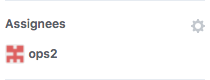

# Review changes to build files

## Example `rivi.yaml`

```yaml
rules:
    build:
      condition:
        files:
          patterns:
            - "gradle.*"
            - "wrapper/"
          extensions:
            - ".gradle"
      labeler:
        label: system/build
      autoassign:
        role: devops
        
roles:
    devops:
      - dev1
      - ops2
      - ops3
```

**Note** The label `system/build` must exists in the repository settings  
**Note** The users `dev1`,`ops2`, and `ops3` must have repository read permissions

## Result

When a pull-request containing changes to the _build_ system is opened:
<p></p>

Rivi will add the label `system/build`:
<p></p>

And assign (randomly) a member from the `devops` role to complete the review:
<p></p>