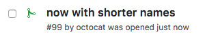
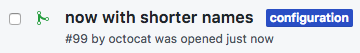

# Detect configuration changes

## Example `rivi.rules.yaml`

```yaml
rules:
    config-change:
        condition:
            files:
              patterns:
                - ".*/src/main/resources/.*.conf"
                - ".*/src/main/resources/.*.properties"
                - ".*/src/main/resources/.*.xml"
        labeler:
          label: configuration
```

**Note** The label `configuration` must exists in the repository settings  

## Result

When a pull-request containing changes to configuration files:
<p></p>

Rivi will add label `configuration` so you can easily detect changes to configuration:
<p></p>