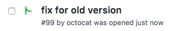
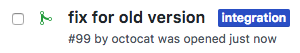

# Pull-requests to integration branch

## Example `rivi.rules.yaml`

```yaml
rules:
    backport:
        condition:
          ref:
            patterns:
              - "integ_.*"
        labeler:
          label: integration
```

**Note** The label `integration` must exists in the repository settings  

## Result

When a pull-request containing changes to integration branches:
<p></p>

Rivi will add label `integration` so you can easily identify them:
<p></p>