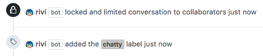

# Prevent review comments war

## Example `rivi.yaml`

```yaml
rules:
    sit-and-talk:
        condition:
          skip-if-labled:
            - chatty
          comments:
            count: ">100"
        locker:
          state: lock
        labeler:
          label: chatty
        commenter:
          comment: "No more comments. You should sit and talk!"
```

**Note** The label `chatty` must exists in the repository settings  

## Result

When there are over 100 review comments,
Rivi will add label `chatty` and lock the issue for any further comments,  
Rivi will also add comment to ask the participants to sit together:
<p></p>
