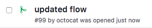
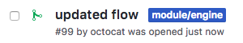

# Changes to a module

## Example `.rivi.yaml`

```yaml
rules:
    engine-module:
      condition:
        files:
          patterns:
            - "engine/"
      labeler:
        label: module/engine
```

**Note** The label `module/engine` must exists in the repository settings

## Result

When a pull-request containing changes to the _engine_ module is opened:
<p></p>

Rivi will add the label `module/engine`:
<p></p>