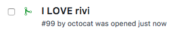
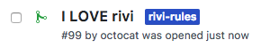

# Changed to rivi rules file

## Example `rivi.rules.yaml`

```yaml
rules:
    rivi:
        condition:
          files:
            patterns:
              - ".rivi.rules.yaml"
        labeler:
          label: rivi-rules
```

**Note** The label `rivi-rules` must exists in the repository settings  

## Result

When there pull-request tries to change `.rivi.rules.yaml` file:
<p></p>

Rivi will add label `rivi-rules`:
<p></p>