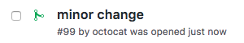
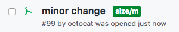
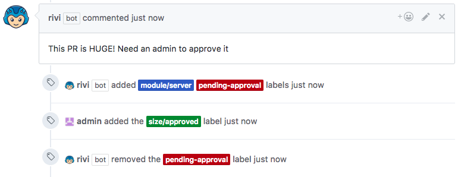

# Sizing check and approval

## Example `rivi.rules.yaml`

```yaml
rules:
    sizing:
      condition:
        skip-if-labeled:
          - pending-approval
          - size/approved
      sizing:
        xs:
          label: size/xs
          changed-files-threshold: 3
          changes-threshold: 40
        s:
          label: size/s
          changed-files-threshold: 5
          changes-threshold: 120
        m:
          label: size/m
          changed-files-threshold: 15
          changes-threshold: 500
        l:
          label: size/l
          changed-files-threshold: 25
        xl:
          label: size/xl
          changed-files-threshold: 40
        default:
          comment: "This PR is HUGE! Need an admin to approve it"
          label: pending-approval
      
    pr-size-approved:
      condition:
        if-labeled:
          - size/approved
      labeler:
        remove: pending-approval
```

**Note** The labels `size/xs`, `size/s`, `size/m`, `size/l`, `size/xl`, `size/approved`, `pending-approval` must exist in the repository settings  

## Result

When a pull-request containing changes it size will be evaluated (and on every update):
<p></p>

Rivi will add the matching size label `size/m` (or update to the new matched size):
<p></p>

If the pull-request exceeds the size settings, you can ask Rivi to comment and wait for admin approval to continue processing :
<p></p>