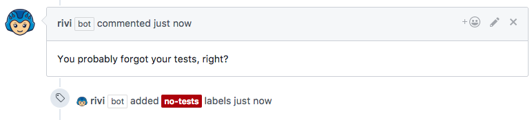

# Check if tests exist

## Example `rivi.yaml`

```yaml
rules:
    has-tests:
        condition:
          order: 8
          files:
            patterns:
              - "\\/.*\\/[a-zA-Z0-9]*Test\\.(java|scala)$"
          skip-if-labeled:
            - ok-no-tests
        labeler:
          label: test-exists
          remove: no-tests
    
    no-tests:
      condition:
        order: 9
        files:
            extensions:
              - ".java"
              - ".scala"
        skip-if-labeled:
          - test-exists
          - ok-no-tests
          - no-tests
      labeler:
        label: no-tests
      commenter:
        comment: "You probably forgot your tests, right?"
```

**Note** The labels `ok-no-tests`, `no-tests`, `test-exists` must exist in the repository settings  

## Result

When a pull-request containing changes to tests files:
<p></p>

Rivi will add label `test-exists` if it detects changes to test files:
<p></p>

In this case, Rivi will also add comment of missing tests:
<p></p>