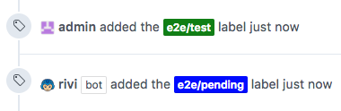

# Trigger end-to-end tests when approved

## Example `rivi.rules.yaml`

```yaml
rules:
    e2e:
        condition:
          skip-if-labled:
            - e2e/pending
          if-labeled:
            - e2e/test
        labeler:
          label: e2e/pending
        trigger:
          endpoint: "http://jenkins.example.com/job/e2e/build"
          content-type: "application/x-www-form-urlencoded"
          body: >
            json={ "parameter":[
                {"name":"COMMIT_USER","value":"{{ .Origin.User }}"},
                {"name":"COMMIT_BRANCH","value":"{{ .Origin.Head }}"}
              ]
            }
```

**Note** The labels `e2e/test`, `e2e/pending` must exist in the repository settings  
**Note** The Jenkins server at `jenkins.example.com` must be internet facing

## Result

When a repository editor is adding `e2e/test` label to pull-request,  
Rivi will add label `e2e/pending` and send HTTP payload to trigger endpoint:
<p></p>
